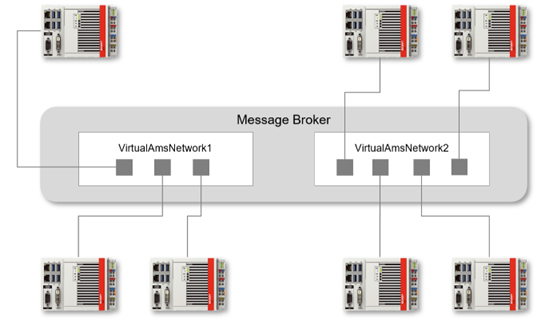

# ADS over MQTT

In addition to the regular method of creating a route to another device via ADS, TwinCAT also provides an in-built ability to create a route by using MQTT.

## InfoSys overview

InfoSys provides the following [overview](https://infosys.beckhoff.com/english.php?content=../content/1033/tc3_ads_over_mqtt/17769357707.html&id=4800773352293992935).

> *Beckhoff ADS (Automation Device Specification) is a communication protocol developed by Beckhoff for efficient data exchange in industrial automation systems. It serves as > the backbone for the integration of devices and software into the PC-based control technology from Beckhoff.
From the perspective of the ADS protocol, ADS-over-MQTT is an additional transport channel over which ADS can be transported. Decoupling communication via an MQTT message > > broker results in a number of advantages, particularly in terms of scalability and flexibility when integrating additional ADS applications. Security mechanisms such as TLS > can be used at the transport layer to secure the communication connection.
With ADS-over-MQTT, the entire data exchange is transparent for the ADS applications, because only the ADS router needs to know and hold the corresponding information on the > MQTT transport channel. In particular, this also enables easy retrofitting for existing applications.
The main use case for ADS-over-MQTT is a classic remote maintenance and remote diagnostics scenario, where the TwinCAT engineering environment (TwinCAT XAE) needs to connect to > one or more controllers for remote debugging. The following diagram illustrates the architecture being created here.*

## MQTT

MQTT requires the use of a Broker to handle the transmission of messages to registered clients.

Both TwinCAT XAE and XAR installations have the in-built ability to act as an MQTT client - no extra installation is required.

This client connects with the broker on one side and with the ADS router on the other which then connects with the target.

This relationship can be seen in the following diagram:


Any MQTT broker can be used. A typical installation uses [Mosquitto](https://mosquitto.org/).

The broker can be installed anywhere on a network. This can include via the internet, which allows for a truly distributed solution. If a client can ‘find’ the broker on the network, then it can be used. This is a networking problem to solve, and not a TwinCAT problem.

Once a client can connect with the broker, the target immediately registers itself by publishing and subscribing to defined topics. These are observable via any other ADS-over-MQTT clients that connect to the broker. Routes are then immediately available for selection from with XAE.

See [InfoSys](https://infosys.beckhoff.com/english.php?content=../content/1033/tc3_ads_over_mqtt/17768315019.html&id=8793359276566777531) here.

## Initial configuration – TwinCAT

An important point to note is that ***any existing ‘regular’ ADS routes to the target that is desired to be connected via MQTT must be deleted first.***

Next, an XML file must be created in the ***“%TWINCAT%\3.1\Target\Routes\”*** directory. The “Routes” directory itself may need to be created manually if it does not already exist.

The ***“%TWINCAT%”*** installation path depends on the build version of TwinCAT being used.

For builds <4026: ***“C:\TwinCAT\”***.

For builds >= 4026: ***“C:\Program Files (x86)\Beckhoff\TwinCAT\”***.

| Build | Path |
|---|---|
| <4026 | C:\TwinCAT\ |
| >=4026 |C:\Program Files (x86)\Beckhoff\TwinCAT\ | 

This file can have any name but must have an .xml extension. A suggested filename is ***“mqtt.xml”***.

It has the following initial basic format:
```xml
<?xml version="1.0" encoding="ISO-8859-1"?> 
<TcConfig xmlns:xsi="http://www.w3.org/2001/XMLSchema-instance" xsi:noNamespaceSchemaLocation="http://www.beckhoff.com/schemas/2015/12/TcConfig"> 
<RemoteConnections>
  <Mqtt>
    <Address Port="1883">127.0.0.1</Address>
    <Topic>VirtualAmsNetwork1</Topic>
    </Mqtt>
  </RemoteConnections>
</TcConfig>
```

The configuration shown above assumes the broker has been installed locally to the runtime and is being used over an unsecured connection.

```xml
<Address Port=”1883”>127.0.0.1</Address>
```
Broker located at 127.0.0.1, i.e. local home address.
Port 1883 is the default port number for unsecured MQTT communications.

```xml
<Topic>VirtualAmsNetwork1</Topic>
```
This is the topic used by this MQTT connection to communicate with other clients that share the same topic name. This allows for ‘virtual’ networks to be created within the broker.

Any changes to this file must be activated with restart of the runtime for the changes to come into effect.

Any ADS-over-MQTT client that uses ‘VirtualAmsNetwork1’ as the topic name can form a route to each other.

From InfoSys:



## Initial configuration – Mosquitto

Mosquitto uses a configuration file named ***”mosquito.conf”***.

In its most basic form, it has the following format:

```ini
allow_anonymous true
listener 1883
```

## Further Configuration

The setup described above allows for an unsecure connection between MQTT clients and the broker.

Further configuration of both TwinCAT and the broker can be made to enable a more secure connection.

The ADS route can be made unidirectional. This may be an important consideration for ‘engineering’ clients, such as using an XAE on a laptop. This allows only ADS commands to be made to a target from XAE but will not allow commands in the reverse direction from the target to XAE.

To enable this, the following edit can be made to the mqtt.xml file:

```xml
<?xml version="1.0" encoding="ISO-8859-1"?> 
<TcConfig xmlns:xsi="http://www.w3.org/2001/XMLSchema-instance" xsi:noNamespaceSchemaLocation="http://www.beckhoff.com/schemas/2015/12/TcConfig"> 
<RemoteConnections>
   <Mqtt Unidirectional="true">
   <Address Port="1883">127.0.0.1</Address>
    <Topic>VirtualAmsNetwork1</Topic>
    </Mqtt>
  </RemoteConnections>
</TcConfig>
```

Beckhoff also provide a plugin for Mosquitto named ***“TcMqttPlugin.dll”***.
This was developed to enable the definition of access rights between the individual TwinCAT ADS routers.
However, development and support of this plugin has been discontinued, so it is not recommended for future use.

Secure TLS connection can be configured requiring the use of certificates and keys.

The first step is to configure the broker to use port 8883, which is the default for secure connections.

```ini
allow_anonymous false
listener 8883 nt-baa-vm03
cafile C:\certs\ca.crt
certfile C:\Program Files\mosquitto\certs\mosquitto.crt
keyfile C:\Program Files\mosquitto\certs\mosquitto.key
require_certificate true
use_identity_as_username true
```
