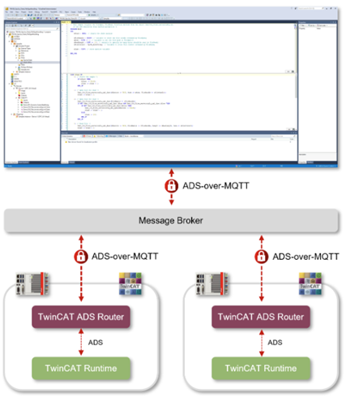

# ADS over MQTT

In addition to the regular method of creating a route to another device via ADS, TwinCAT also provides an in-built ability to create a route by using MQTT.

## InfoSys overview

InfoSys provides the following [overview](https://infosys.beckhoff.com/english.php?content=../content/1033/tc3_ads_over_mqtt/17769357707.html&id=4800773352293992935).

> *Beckhoff ADS (Automation Device Specification) is a communication protocol developed by Beckhoff for efficient data exchange in industrial automation systems. It serves as > the backbone for the integration of devices and software into the PC-based control technology from Beckhoff.
From the perspective of the ADS protocol, ADS-over-MQTT is an additional transport channel over which ADS can be transported. Decoupling communication via an MQTT message > > broker results in a number of advantages, particularly in terms of scalability and flexibility when integrating additional ADS applications. Security mechanisms such as TLS > can be used at the transport layer to secure the communication connection.
With ADS-over-MQTT, the entire data exchange is transparent for the ADS applications, because only the ADS router needs to know and hold the corresponding information on the > MQTT transport channel. In particular, this also enables easy retrofitting for existing applications.
The main use case for ADS-over-MQTT is a classic remote maintenance and remote diagnostics scenario, where the TwinCAT engineering environment (TwinCAT XAE) needs to connect to > one or more controllers for remote debugging. The following diagram illustrates the architecture being created here.*

## MQTT

MQTT requires the use of a Broker to handle the transmission of messages to registered clients.

Both TwinCAT XAE and XAR installations have the in-built ability to act as an MQTT client - no extra installation is required.

This client connects with the broker on one side and with the ADS router on the other which then connects with the target.

This relationship can be seen in the following diagram:

